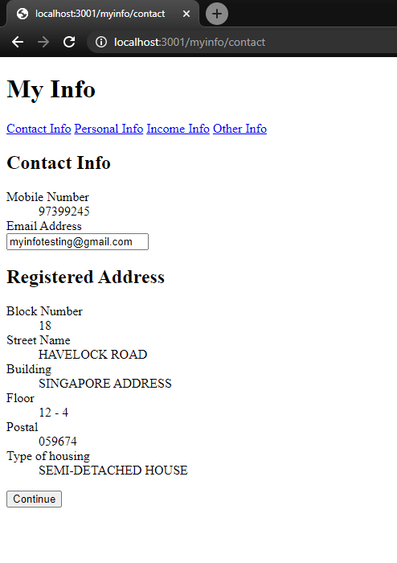
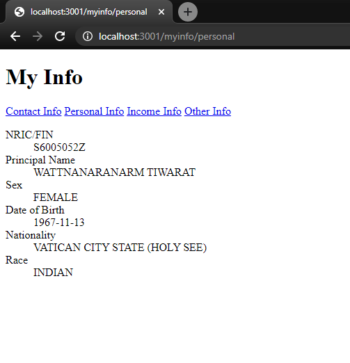

ABLR Coding Challenge 2020
==========================

## Setup

```shell script
python3 -m venv env
pip install -r requirements.txt
npm install
npm run build
python manage.py migrate
python manage.py runserver 0.0.0.0:3001
```

## Sample work

* Contact Info



* Personal Info


